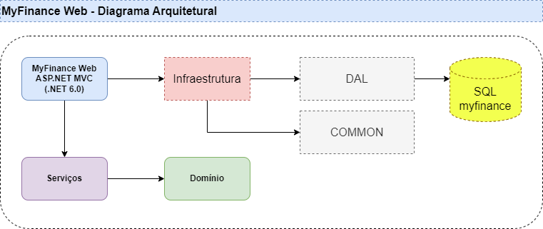
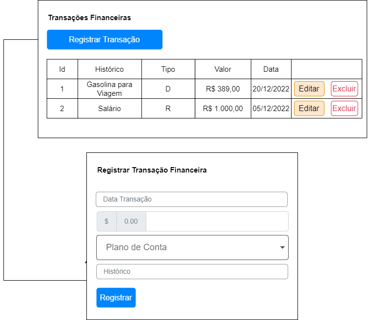
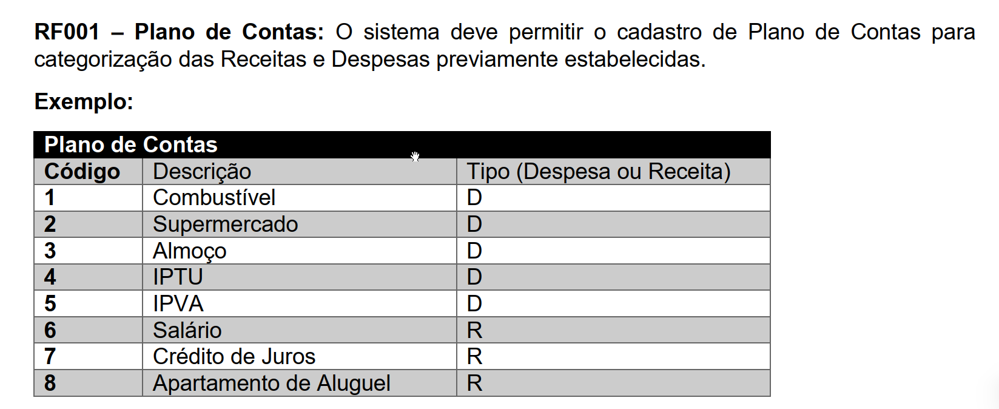
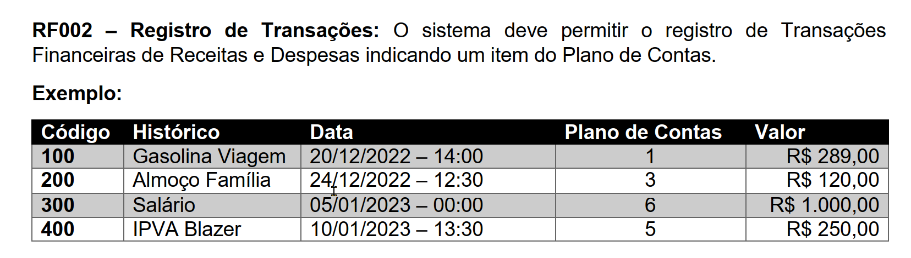

# 1 Sobre esse repositório

Repositório com o conteúdo do trabalho prático da disciplina **Práticas de Implementação e Evolução de Software** da Pós graduação em Engenharia de Software - Oferta 7 - Turma 1 - do Instituto de Educação Continuada da PUC Minas

# 2 Sobre o projeto

Esse projeto didático teve o intuito de criar uma pequena aplicação financeira para uso pessoal. A aplicação foi criada em ASP.NET MVC (Model-View-Controller) com Razor pages e persistência de dados em Microsoft SQL Server 2022, Developer Edition. O mapeamento dos dados foi feito usando Entity Framework Core 9.

A proposta do projeto está disponível no arquivo [ConcepçãoMyFinanceWeb.pdf](./docs/ConcepçãoMyFinanceWeb.pdf)

## 2.1 Modelo arquitetural resumido

O modelo arquitetural resumido é apresentado na imagem abaixo e a implementação contida nesse projeto satisfaz parcialmente esse desenho. Algumas mudanças são a atualização da versão do SDK do .NET e uma simplificação com respeito às camadas do projeto. O projeto presente contém todas as camadas em um único arquivo .csproj por questões de tempo reduzido para uma implementação mais detalhada.


*Figura 1: Modelagem Arquitetural elaborada pelo Professor Filipe Tório*

## 2.2 Protótipo de telas

Dois protótipos simplificados da tela para exibição, edição, inserção e edição das transações e dos planos de contas são apresentados abaixo. Como são protótipos de baixa fidelidade, as telas criadas no projeto não correspondem detalhadamente à essas representações.


*Figura 2: Exemplo de tela para o Plano de Contas elaborada pelo Professor Filipe Tório*


*Figura 3: Exemplo de tela para as Transações elaborada pelo Professor Filipe Tório*

## 2.3 Como executar a aplicação em ambiente local

### 2.3.1 Pré-requisitos
Para executar essa aplicação são necessários os seguintes requisitos:
- Ter o SDK do .NET instalado em versões iguais ou superiores ao **.NET 8**
  - Para essa versão, consulte o link [Download .NET 8.0](https://dotnet.microsoft.com/en-us/download/dotnet/8.0));
- Um **editor de código** como o `Visual Studio Code` ou uma **IDE** como `Visual Studio Community 2022`
  - Essas são apenas sugestões de uso mas outros editores e IDEs podem ser também usados;
- E uma versão do **Microsoft SQL Server 2022** instalada no seu computador (para criar o banco para o desenvolvimento e execução)
  - Ou ainda acesso a uma instância do **Azure SQL Server** com permissão para criar um novo banco de dados.
- Clonar esse repositório em seu computador usando os comandos abaixo:
```bash
# Escolher um diretório para clonar o repositório
cd {diretório de sua preferência}

# Comando para clonar o repositório
git clone https://github.com/dickson-souza-projects/myfinance-web-dotnet.git

# Acessar o conteúdo do repositório
cd myfinance-web-dotnet
```

### 2.3.2 Criando o banco de dados

A criação do banco de dados é feita através do script [DB-Creation-And-Configuration.sql](./Scripts/DB-Creation-and-Configuration.sql): por meio dele é criado o banco de dados **MyFinance** contendo duas tabelas: **PlanoConta** e **Transacao**.

A tabela **PlanoConta** descreve os tipos de transação existente, tais como despesas com combustível, água, luz e recebíveis como salários, aluguéis e dividendos.


*Figura 4: Exemplo de Tabela de Plano de Contas (extraído do documento [ConcepçãoMyFinanceWeb.pdf](./docs/ConcepçãoMyFinanceWeb.pdf), elaborado pelo professor Filipe Tório)*

Já a tabela **Transacao** contém registros de transações individuais, categorizadas pelo **PlanoConta** correspondente.


*Figura 5: Exemplo de Tabela de Transações (extraído do documento [ConcepçãoMyFinanceWeb.pdf](./docs/ConcepçãoMyFinanceWeb.pdf), elaborado pelo professor Filipe Tório)*

#### 2.3.2.1 Alimentação do banco de dados

Para facilitar o onboarding no projeto, um pequeno script foi criado para inserir alguns dados nas duas tabelas. Esse script pode ser encontrado no arquivo [Feeding-Database.sql](./Scripts/Feeding-Database.sql). E um outro script está disponível com algumas consultas simples no arquivo [Queries.sql](./Scripts/Queries.sql).

### 2.3.3 Execução

Para executar o projeto sem depuração, abra a solução [myfinance-web.sln](myfinance-web.sln) no Visual Studio Community 2022 e pressione `CTRL + F5`. Já para executar usando os recursos embutidos de depuração no Visual Studio Community 2022, pressione apenas `F5` - lembre-se de definir alguns pontos de interrupção para monitorar seções específicas do código.


